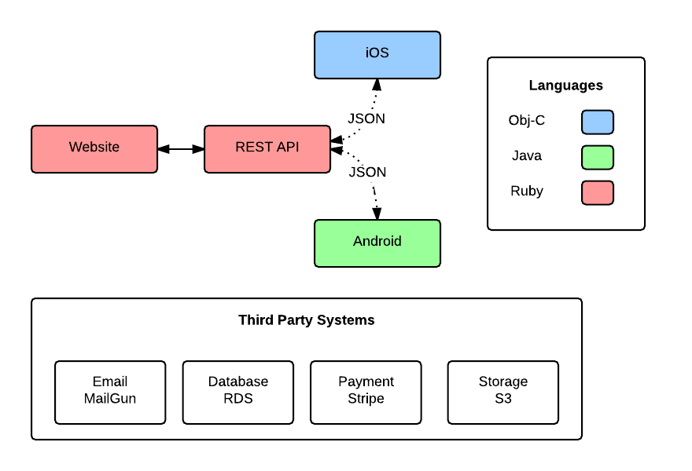

# Fooooo

Here is a brief project description


## Getting Started

1. Clone the Repo ```git clone [repo]```

1. Open project in Android Studio

1. Sync with maven to install Dependencies

1. Make sure the app builds

1. Write some code!


## Android System Dependencies

* Java 6+
* Android SDK
* Android Studio


## System Overview

**JSON API** 
* Production - [Change Link](http://api.example.com)
* Staging - [Change Link](http://staging.example.com)
* Codebase [Change link](http://github.com/example/json-api)

**Mobile App**
* Store Listing - [Change Link](https://play.google.com/store/apps/details?id=com.kiloo.subwaysurf)
* Code - [Github](http://github.com/example/mobile-app)

**High-Level Overview Diagram (from LucidChart)**



## Contributing

1. [Change Link](Repo/fork)
2. Create your feature branch `git checkout -b my-new-feature`
3. Commit your changes `git commit -am 'Add some feature'`
4. Push to the branch `git push origin my-new-feature`
5. Create a new Pull Request

